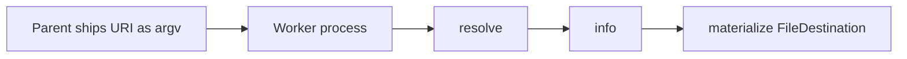

# Testdrive: ship a URI, get a file

A parent process has a URI and nothing else. It starts a worker and passes that URI as an argument. The worker does not inspect the scheme. It asks `urisolver` for a local file, then prints a JSON report of what it received.

Two URIs go through that same worker:

1. A file on local disc (`file:`).
2. The Zenodo record `https://zenodo.org/records/23025715`.



## What the package delivers

`resolve(uri)` establishes access. It returns a resource and does not copy the body.

From that resource the worker reads:

| Field | Meaning |
| --- | --- |
| `resource.uri` | The URI that was shipped, unchanged |
| `info().kind` | `file` |
| `info().exists` | `true` |
| `info().size_bytes` | Byte length of the resource |
| `supports("info")`, `supports("materialize")` | Both true. These Tier 0 operations are always present |

`materialize(FileDestination(dest))` is the delivery. It writes an independent copy and returns a `MaterializedResult`:

| Field | Value |
| --- | --- |
| `value` | Path of the staged file. The path exists and its bytes are the resource |
| `form` | `path` |
| `source_uri` | The shipped URI |
| `resolved_uri` | The concrete URI that was read |
| `is_reference` | `false` |
| `strategy` | `"native"` |
| `size_bytes` | Same length as `info().size_bytes` |

`strategy="native"` means the resolver produced the requested bytes directly. `is_reference=false` means the staged path is a copy, so deleting or changing it leaves the source alone.

The other Tier 0 delivery is `materialize(MemoryDestination())`. Its `value` is the file bytes and its `form` is `native`. The local story requests this with `--memory`. The Zenodo story skips it: the check there is the staged file's MD5, so the 52 MiB object stays on disc.

The call the worker is built around:

```python
def stage(uri: str, dest: Path, *, context: Context) -> MaterializedResult:
    return resolve(uri, context=context).materialize(
        FileDestination(dest, overwrite=True)
    )
```

The running worker resolves once, calls `info()`, then materializes that same resource, so the report and the file come from one access.

## How a run is split

The parent and the worker are separate processes. The only thing that crosses the boundary is the URI string (plus the destination path the parent chose).

```text
parent                         worker
  |  argv: URI, DEST             |
  |----------------------------->|  Context with a private registry
  |                              |  resolve(URI)          # access, no body
  |                              |  info()                # kind, size, label
  |                              |  materialize(FileDestination(DEST))
  |  JSON report on stdout       |
  |<-----------------------------|
  |  compare bytes or MD5        |
```

The worker's registry is private to that process. It contains the built-in `file` resolver and the example Zenodo resolver. The process-wide default registry is left alone, and the Zenodo resolver is not a package entry point.

Stdout is one JSON object. A non-zero exit means delivery failed; the traceback is on stderr.

The two stories above do not open a back channel. A local file is readable because the worker process can read that path. The Zenodo record in this example is public, so the worker never asks for a credential.

## Asking for access

When a resolver does need a credential, it asks through an exchange of opaque bytes. The exchange does not know which transport it is on, and it does not know that a secret provider exists. A helper above it translates `get_secret(secret_id)` into those bytes and back into a string map.

One secrets manager holds every id. The resolution catalog selects which id applies to the resource being resolved: `secret_id` is the default for the scheme, and `secrets` maps a path prefix to another id. The longest matching prefix wins. The Tiled and Globus example READMEs show the paths.

The same helper works on the three ways this package already communicates:

| Transport | What it is | Where it already appears |
| --- | --- | --- |
| In-process call | `DirectExchange` calls a `bytes -> bytes` function | `Context` and `SecretsProvider` in one process |
| Byte stream | `StreamExchange` writes a 4-byte length and the payload, then reads one frame back. A pipe and a socket are the same type | This testdrive's worker, started with `subprocess` |
| HTTP POST | `HttpExchange` posts the payload and returns the body. The URL belongs to the transport | Namespace client and server, `POST /resolve` |

OpenBao, AWS Secrets Manager, and Google Secret Manager stay behind the helper. Each already returns a string map from `get_secret`. The exchange module does not name them.

The parent keeps one end of a stream and passes the other end to the worker:

```bash
python examples/testdrive.py --worker URI DEST --exchange-fd N
```

`N` is an inherited file descriptor, not a secret. The worker wraps it in `StreamExchange`, then in `ExchangeSecrets`, and sets that as `Context.secrets`. Asking again is how a fresh map is obtained. The delivery JSON does not include the map. The public stories leave `--exchange-fd` unset.

## Case 1 — local disc

The parent writes a small payload, `testdrive-local\n`, under a temporary directory and ships `Path.resolve().as_uri()` (`file:///...`).

The worker uses `FileResolver` in `src/urisolver/resolvers/file.py`. `resolve` maps the URI to that path. `info` comes from `stat` and does not read the file. `materialize` copies the bytes onto `DEST` via a temporary name in the destination directory, then replaces that name into place.

With `--memory`, the worker also calls `MemoryDestination()` and puts the bytes in the report as base64 (`memory_bytes_b64`, `memory_form` = `native`).

The parent checks that the staged file and the memory bytes both equal the original payload.

## Case 2 — Zenodo record

Shipped URI:

```text
https://zenodo.org/records/23025715
```

That URL is the record page. The record has one file:

| | |
| --- | --- |
| key | `pdb_cells.duckdb` |
| size | `54538240` |
| checksum | `md5:cdabd111595d9fcd5a3700603063f7aa` |
| content | `https://zenodo.org/api/records/23025715/files/pdb_cells.duckdb/content` |

Because the record has exactly one file, the record URI resolves as that file (`kind=file`), and the same `stage` call used for `file:` works here.

`resolve` GETs `https://zenodo.org/api/records/23025715` and keeps the JSON metadata. It does not download `pdb_cells.duckdb`. After that:

- `info().size_bytes` is `54538240`
- `info().label` is `pdb_cells.duckdb`
- `info().canonical_media_type` is `application/octet-stream` (the filename has no known media type)
- `resolved_uri` is the content URL above

`materialize` streams the content URL to a temporary file in the destination directory, checks the size and MD5 against the record, then replaces the temp name onto `DEST`. A mismatch raises `MaterializationError` and the temp file is removed.

`HARDLINK`, `SYMLINK`, and `IN_PLACE` raise `UnsupportedDestinationError`. Those policies need a local source path; this file is remote, so the only delivery is a copy.

The example accepts `https://zenodo.org/records/<id>` with an optional trailing slash. Any other host, a query, a fragment, or a record that does not have exactly one file raises `InvalidURIError` or `ResolutionError`. Redirects are accepted only when they stay on `https://zenodo.org`.

## Run it

From a checkout (the script adds `src/` to `sys.path` when that directory exists):

```bash
python examples/testdrive.py
```

That runs both stories. Case 2 downloads about 52 MiB. A successful run ends with `both deliveries match the Tier 0 contract`.

Ship one URI yourself:

```bash
python examples/testdrive.py --worker file:///absolute/path/source.dat /tmp/staged.dat --memory
python examples/testdrive.py --worker https://zenodo.org/records/23025715 /tmp/pdb_cells.duckdb
```

Tests:

```bash
pytest tests/test_testdrive.py
```

That subprocesses the worker for the local file. The Zenodo download runs only when `URISOLVER_ZENODO=1` is set, so a normal pytest stays offline.

```bash
URISOLVER_ZENODO=1 pytest tests/test_testdrive.py
```
